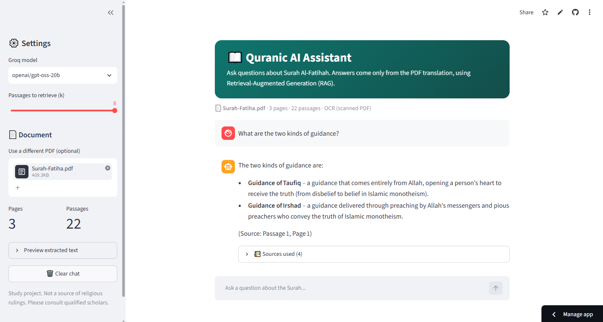
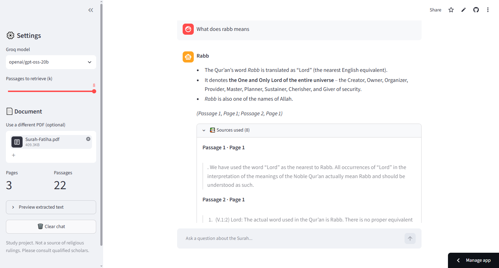

# 📖 Quranic AI Assistant Using RAG

A Streamlit app that answers questions about **Surah Al-Fatihah** using
Retrieval-Augmented Generation (RAG) over an English-translation PDF.

🔗 **Live demo:** https://quranic-rag-assistant-toapnfqdhserptsvnrnvrx.streamlit.app/





## How it works
PDF → text extraction (OCR for scanned pages) → chunking → embeddings →
FAISS vector search → top-k passages → Groq LLM → answer with page sources

1. **Ingestion:** the PDF is scanned images, so pages are read with Tesseract OCR and cleaned.
2. **Indexing:** text is split into ~500-character chunks with page numbers and embedded with `all-MiniLM-L6-v2`.
3. **Retrieval:** the question is embedded and the k most similar chunks are fetched from FAISS.
4. **Generation:** a Groq LLM answers using only those chunks and cites the page.

## Features
- Chat interface with example questions and chat history
- Answers grounded in the PDF, with expandable source passages and page numbers
- Optional upload of another surah PDF (OCR is used automatically for scanned files)
- Model choice and retrieval-size controls in the sidebar

## Tech stack
Streamlit · LangChain · FAISS · Hugging Face embeddings · Groq API · pdfplumber · Tesseract OCR

## Sample questions and answers
| Question | Screenshot |
|---|---|
| What does the word Rabb mean? |  |
| What is said about reciting Surat Al-Fatihah in prayer? |  |


## Project structure
```text
├── app.py
├── Surah-Fatiha.pdf
├── ocr_cache/
├── docs/screenshots/
├── .streamlit/config.toml
├── packages.txt
├── requirements.txt
├── .gitignore
└── README.md
```

## Run locally
```bash
git clone https://github.com/faaiz-ahmed/quranic-rag-assistant
cd quranic-rag-assistant
pip install -r requirements.txt   # also install Tesseract OCR on your system
export GROQ_API_KEY="your_key"    # Windows: set GROQ_API_KEY=your_key
streamlit run app.py
```

## Deploy on Streamlit Cloud
Push to GitHub → create the app from `app.py` → add `GROQ_API_KEY` under
Settings → Secrets.

## Limitations
- Answers are only as good as the PDF text and OCR quality.
- The app is a study aid, not a source of religious rulings.

## Source of the PDF
<Write the PDF's title and publisher here.>

## Author
Faaiz · B.S. Artificial Intelligence, DUET Karachi
